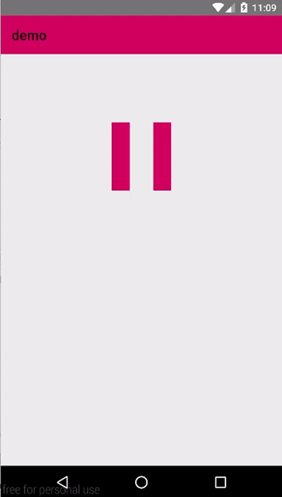

### NativeScript Play Pause Button



Example:

```xml
<Page xmlns="http://schemas.nativescript.org/tns.xsd"
	xmlns:PlayPause="nativescript-play-pause-button"
	loaded="pageLoaded">
	<StackLayout backgroundColor="#ececec">
		<PlayPause:PlayPauseButton width="100" height="100" playPauseTap="PPTapped"  buttonColor="#e11a60" marginTop="100"></PlayPause:PlayPauseButton>
	</StackLayout>
</Page>
```

Android based on: https://github.com/recruit-lifestyle/PlayPauseButton

iOS(Coming soon) based on: https://github.com/suzuki-0000/AnimatablePlayButton

